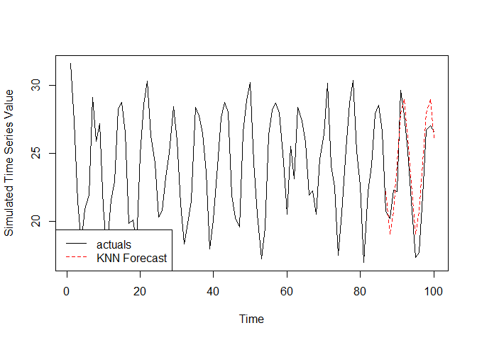
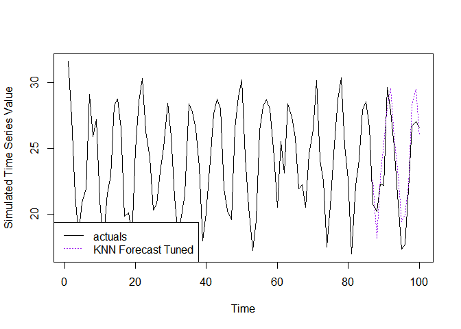

<!-- README.md is generated from README.Rmd. Please edit that file -->

# knnwtsim

<!-- badges: start -->
<!-- badges: end -->

The goal of knnwtsim is to provide a package to share and implement a
project I have been working on around the use of KNN forecasting in
situations where the response series of interest can be predicted by a
combination of its’ own recent realizations, its own periodic patterns,
and by the values of one or multiple exogenous predictors.

The package and project are focused primarily into two components. The
first being calculation of a similarity measure which takes into account
all three factors listed above (`S_w`), and can weight the degree to
which each component contributed to the overall similarity. The second
being the usage of this measure to identify neighbors and perform KNN
regression.

## Formulation

### Weighted Similarity Measure `S_w`

The Similarity measure I have formulated for incorporating the three
factors listed above is:

`S_w = alpha*S_t + beta*S_p + gamma*S_x`

Where `S_t` is the matrix calculated by `StMatrixCalc()` to measure
similarity in terms of pure recency between all observations. `alpha` is
the weight between 0-1 assigned to this matrix in the calculation of
`S_w`.

`S_p` is the matrix calculated by `SpMatrixCalc()` to measure similarity
in terms of where each observation falls along a periodic cycle relative
to all others. `beta` is the weight between 0-1 assigned to this matrix
in the calculation of `S_w`.

`S_x` is the matrix calculated by `SxMatrixCalc()` to measure similarity
between all observations in terms of the values of one or more exogenous
predictors associated with a given observation. `gamma` is the weight
between 0-1 assigned to this matrix in the calculation of `S_w`.

The function `SwMatrixCalc()` calls each of these previous functions to
generate the final matrix to use in `knn.forecast()`

The weights `alpha`, `beta`, and `gamma` are recommended to be set so
that they sum to 1. In this case each element of `S_w` should also be
between 0-1, with the diagonal elements being equal to 1.

### KNN Forecasting

K Nearest Neighbors forecasting is implemented in this package through
the function `knn.forecast()`. Using a provided similarity matrix, note
that this function does not actually require `S_w` specifically is used,
the function will perform K Nearest Neighbors regression on each point
in a specified index `f.index.in`, returning the mean of the identified,
`k.in`, neighbors in the response series `y.in`.

Mathematically the estimate for a given point `y_t` is formulated as the
mean of the previous points in the series `y_i` identified to be in the
neighborhood of `y_t`, `K(y_t)`.

In the neighborhood `K(y_t)` will be the `k` observations of `y_i` with
the highest similarity to `y_t` of all eligible members of the time
series, meaning `i < t`. Currently in `knn.forecast()` this eligibility
constraint is enforced by only considering the rows of the similarity
matrix at indices which are not present in `f.index.in` when selecting
neighbors while performing KNN regression on each point in `f.index.in`,
thus preventing the corresponding points in `y.in` at those indices from
being selected as neighbors. Meaning there should not be rows of higher
index in your similarity matrix provided to `knn.forecast()` than the
max value in `f.index.in`, or the values of `y.in` at those indices will
be considered eligible neighbors.

## Installation

You can install the development version of knnwtsim from
[GitHub](https://github.com/) with:

``` r
# install.packages("devtools")
devtools::install_github("mtrupiano1/knnwtsim")
```

## Example with Known Similarity Matrix Weights and `k`

This is a basic example which shows a full forecasting workflow if the
weights to use in the generation of `S_w`, and the hyperparameter `k`
are known:

``` r
library(knnwtsim)
## basic example code
data("simulation_master_list")
series.index <- 15
ex.series <- simulation_master_list[[series.index]]$series.lin.coef.chng.x

#Weights pre tuned by random search. In alpha, beta, gamma order   
pre.tuned.wts <- c(0.2148058, 0.2899638, 0.4952303)
pre.tuned.k <- 5

df <- data.frame(ex.series)
#Generate vector of time orders
df$t <- c(1:nrow(df))

#Generate vector of periods
nperiods <- simulation_master_list[[series.index]]$seasonal.periods
df$p <- rep(1:nperiods,length.out=nrow(df))

#Pull corresponding exogenous predictor(s)
X <- as.matrix(simulation_master_list[[series.index]]$x.chng)
XdistMetric <- 'euclidean'

#Number of points to set aside for validation
val.len <- ifelse(nperiods==12,nperiods,nperiods*2)

#Calculate the weighted similarity matrix Sw 
Sw.ex <- SwMatrixCalc(#For the recency similarity St
                      t.in = df$t
                      #For the periodic similarity Sp
                      ,p.in=df$p, nPeriods.in = nperiods
                      #For the exogenous similarity Sx
                      ,X.in=X, XdistMetric.in = XdistMetric
                      #Weights to be applied to each similarity
                      ,weights=pre.tuned.wts)

#View the top corner of the weighted similarity matrix Sw 
cat('\n Dimensions and Slice of S_w \n')
#> 
#>  Dimensions and Slice of S_w
print(dim(Sw.ex))
#> [1] 100 100
print(Sw.ex[1:5,1:5])
#>           1         2         3         4         5
#> 1 0.9999999 0.5825337 0.4249690 0.4115130 0.5589633
#> 2 0.5825337 0.9999999 0.5989170 0.5690332 0.4841708
#> 3 0.4249690 0.5989170 0.9999999 0.6673498 0.4414853
#> 4 0.4115130 0.5690332 0.6673498 0.9999999 0.5582553
#> 5 0.5589633 0.4841708 0.4414853 0.5582553 0.9999999
```

``` r
#Index we want to forecast 
val.index <- c((length(ex.series) - val.len + 1):length(ex.series))

#Generate the forecast 
knn.frcst <- knn.forecast(Sim.Mat.in = Sw.ex
                          ,f.index.in = val.index
                          ,k.in=pre.tuned.k
                          ,y.in=ex.series)

ts.plot(ex.series,ylab="Simulated Time Series Value")
lines(x=val.index,y=knn.frcst,col='red',lty=2)
legend('bottomleft',legend=c('actuals','KNN Forecast'),col=c('black','red'),lty=c(1,2))
```



## Example with Tuning of Similarity Matrix Weights

In most cases you will likely want to tune the hyperparameters used in
the construction of `S_w`, and the number of nearest neighbors, `k`, to
consider for any given point. There are many approaches that can be
taken to accomplish this tuning, and many users choose to implement
their preferred approach. However, for those who want something
pre-built I have included a simple tuning function with the package
called `knn.forecast.randomsearch.tuning()`. This function creates a
randomly generated `Grid` of potential sets of hyperparameters
`k`,`alpha`,`beta`,`gamma` and generates a forecast of length `test.h`
on the last `test.h` points in the series. The best set of parameters
are selected based on which row of the `Grid` led to the forecast with
the lowest MAPE (Mean Absolute Percent Error) over the points in the
forecast, and returned as the `weight.opt` and `k.opt` items of the list
object returned by the function. Additionally, the ‘optimal’ similarity
matrix to pass to `knn.forecast()` is also returned as `Sw.opt`, as are
the testing grid (`Grid`), best test MAPE (`Test.MAPE.opt`), and the
full vector of test MAPE values (`MAPE.all`) corresponding to each row
in `Grid`.

If you do not want to tune the hyperparameters on the entire series and
prefer to leave some points for validation of the tuned result the
`val.holdout.len` will remove that many points from the end of the
series, and will perform the test forecasts on the `test.h` points at
the end of the series after the validation observations are removed.

Using the example series from the previous section, we can reproduce the
‘pre-tuned’ weights from the previous section and generate a forecast
using the included tuning function.

``` r
#Calcualte component similarity matrices
St.ex <- StMatrixCalc(df$t)
Sp.ex <- SpMatrixCalc(df$p,nPeriods=nperiods)
Sx.ex <- SxMatrixCalc(X)

#Set seed for reproducibility 
set.seed(10)
#Run tuning function 
tuning.ex <- knn.forecast.randomsearch.tuning(grid.len=10**4
                                               ,y.in = ex.series
                                               ,St.in = St.ex 
                                               ,Sp.in = Sp.ex
                                               ,Sx.in = Sx.ex
                                               ,test.h = val.len
                                               ,max.k = NA
                                               ,val.holdout.len=val.len)


cat('\n Tuned Hyperparameters \n')
#> 
#>  Tuned Hyperparameters
cat('\n S_w Weights \n')
#> 
#>  S_w Weights
print(tuning.ex$weight.opt)
#> [1] 0.2148058 0.2899638 0.4952303
cat('\n k \n')
#> 
#>  k
print(tuning.ex$k.opt)
#> [1] 5

#Pull out tuned S_w and k
k.opt.ex <- tuning.ex$k.opt
Sw.opt.ex <- tuning.ex$Sw.opt
```

``` r
#Generate the forecast 
knn.frcst.tuned <- knn.forecast(Sim.Mat.in = Sw.opt.ex
                              ,f.index.in = val.index
                              ,k.in=k.opt.ex 
                              ,y.in=ex.series)

ts.plot(ex.series,ylab="Simulated Time Series Value")
lines(x=val.index,y=knn.frcst.tuned,col='purple',lty=3)
legend('bottomleft',legend=c('actuals','KNN Forecast Tuned'),col=c('black','purple'),lty=c(1,3))
```


